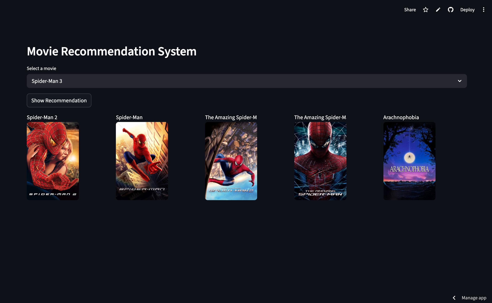

# 🎬 Movie Recommender System

🔗 **Live Demo:** https://sanu-movie-recommender.streamlit.app/

## 📸 Screenshots

---

## 📌 Overview
This is a Machine Learning-based Movie Recommendation System built using Python and Streamlit.  
It recommends similar movies based on the selected movie using a precomputed similarity matrix.

---

## 🚀 Features
- 🎥 Select a movie from dropdown  
- 🔁 Get top 5 similar movie recommendations  
- 🖼️ Movie posters fetched using TMDB API  
- ⚡ Fast and interactive UI using Streamlit  
- ☁️ Deployed on Streamlit Cloud  

---

## 🛠️ Tech Stack
- Python  
- Streamlit  
- Pandas  
- NumPy  
- TMDB API  
- gdown  

---

## ⚙️ How It Works
1. User selects a movie  
2. System finds similar movies using cosine similarity  
3. Top 5 recommended movies are returned  
4. Posters are fetched from TMDB API  

---

✨ Future Improvements
	•	Add search functionality
	•	Improve recommendation accuracy
	•	Add movie details page
	•	Use deep learning models

⸻

👨‍💻 Author

Suman Kumar
